# BDMVフォルダーを書き込み可能なISOに変換する

このガイドは、BDMVディスクフォルダーを多層メディアに安全に書き込めるBD-ROM ISOにまとめる手順を、順を追って説明します。tsMuxeR GUI 2.11.0で作成しており、スクリーンショットは実際の画面と同じものです。

## このタブの役割

`BDMVフォルダー → ISO` タブは、既存のBDMVディスクフォルダーをバイト単位でそのまま書き込み可能なBD-ROM ISOにまとめます。BD-Jメニューやすべてのストリームは元のまま保持され、再多重化（再mux）は行いません。多層ディスク（2層のBD-R DL、または3層・4層のBD-R XL）では、レイヤーブレイクガードが層の切り替わり付近の不良が起きやすいセクターをゼロで埋めるため、映像はディスクの最悪のセクターに当たることなく、層の境界をまたいでも途切れずに再生されます。

## 始める前に

必要なもの:

* BDMVディスクフォルダー、つまり `BDMV`（通常は `CERTIFICATE` も）を**含む**フォルダー。自分でオーサリングしたものでも、すでに読み取り可能なディスクのコピーでもかまいません。
* 書き込む予定のブランクメディア（BD-R DL、BD-RE DL、BD-R XLのいずれか）。適切なディスクの種類を選ぶために必要です。

## ステップ1: タブを開く

tsMuxeR GUIを起動し、`BDMVフォルダー → ISO` タブに切り替えます。上部のテキストがこのタブの役割を要約しています。

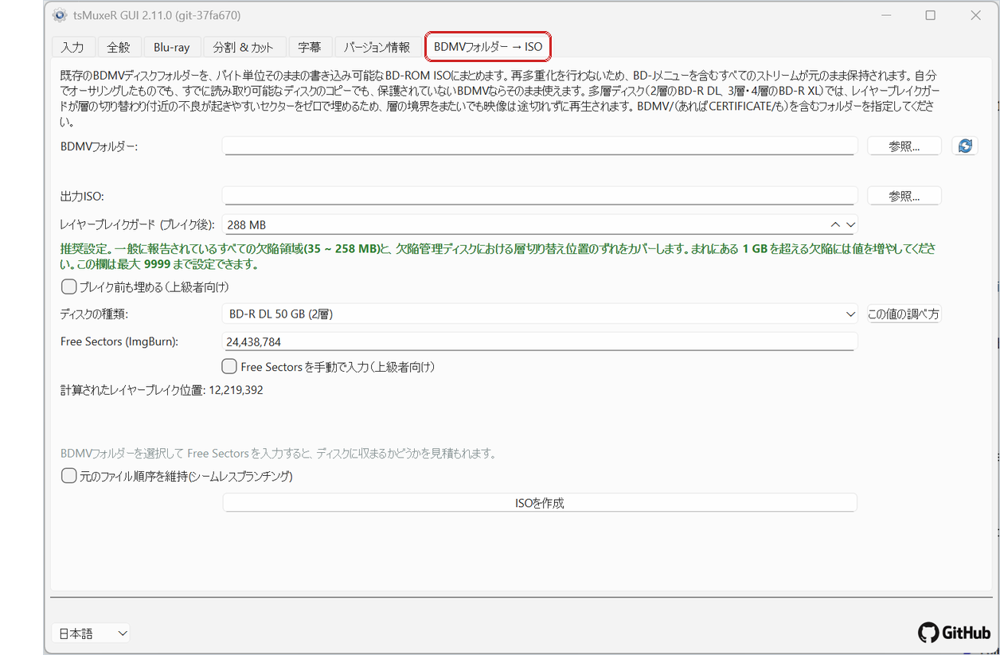

## ステップ2: ディスクフォルダーを選ぶ

`BDMVフォルダー` の横の `参照` をクリックし、`BDMV` と `CERTIFICATE` を**含む**フォルダーを選びます。`BDMV` フォルダーそのものではありません。

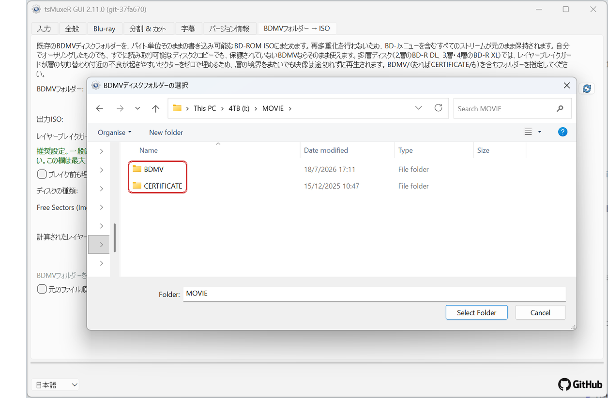

## ステップ3: 入力された内容を確認する

フォルダーを選ぶと、タブが自動的に入力されます:

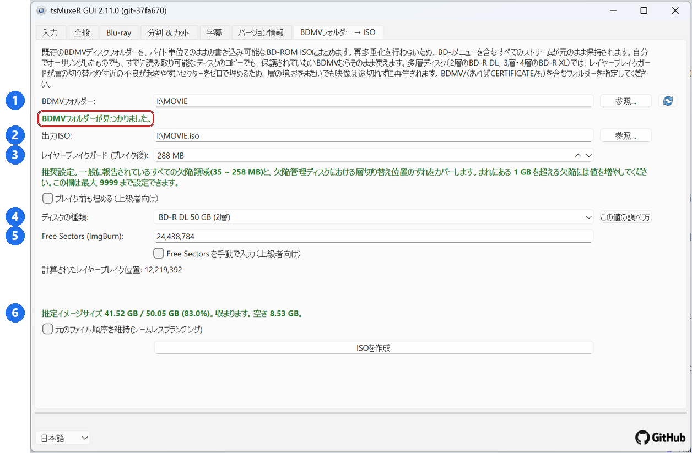

1. 選んだフォルダー。緑色の `BDMVフォルダーが見つかりました` というメッセージで確認できます。
2. 出力ISO。元のフォルダーの隣に自動的に置かれます。`参照` で変更できます。
3. レイヤーブレイクガード。推奨値の288 MBがあらかじめ設定されています（詳細は後述）。
4. 書き込むディスクの種類。
5. ブランクディスクのFree Sectorsと、その下に計算されたレイヤーブレイク位置。
6. 収まるかどうかの推定: イメージのサイズ、選んだディスクの種類に収まるか、どれだけ余りがあるか。同じ行は、内容が収まらない場合にも警告します。

すべて問題なければ、そのまま `ISOを作成` に進めます。以降のセクションでは各設定を説明します。

## ディスクの種類

実際に書き込むディスクを選びます。この選択でディスク容量が決まり、いくつの層切り替わりを保護する必要があるかも決まります。2層ディスクなら1か所、3層なら2か所、4層なら3か所です。

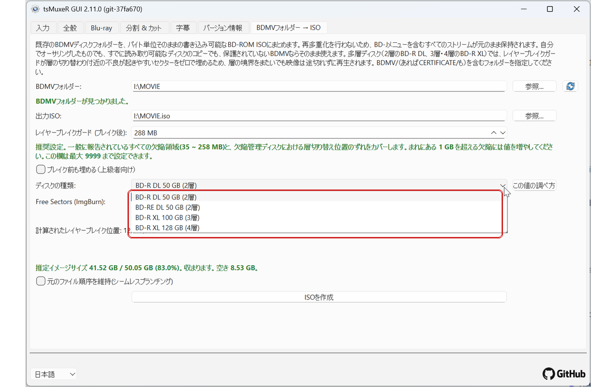

## Free Sectors

一般的なブランクディスクでは、この欄は自動で入力され、ロックされたままになります。お使いの書き込みソフトが特定のディスクについて別の値を報告する場合は、`Free Sectorsを手動で入力（上級者向け）` にチェックを入れてその数値を入力します。計算されたレイヤーブレイク位置がすぐに更新されます。

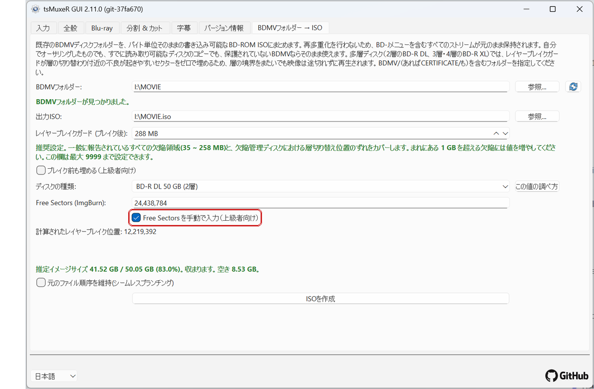

### ImgBurnでFree Sectorsの値を調べる方法

欄の横の `この値の調べ方` ボタンでもこの説明が開きます。**注意:** ImgBurnは独立したサードパーティ製ソフトウェアであり、tsMuxeRの一部ではなく、このプロジェクトとの提携・推奨・保守の関係もありません。ここでは広く使われている一例として示しているだけで、ディスクのFree Sectorsを報告できる同等の書き込みソフトなら何でも同じように使えます。

ImgBurnを起動し、**Write image file to disc** を選びます:

ブランクディスクをドライブに入れます。右側のディスク情報パネルに **Free Sectors** が表示されます。これが入力する数値です:

Free Sectorsの値そのものを使ってください。Free Space（バイト単位）や、別のツールが報告するセクター数ではありません。Free Sectorsだけがディスクの完全なフォーマット済み容量です。

## ディスクをどれくらい埋めるか

ディスクは、いっぱいまでではなく約90パーセントを目安に埋めるようにしてください。光ディスクは内周から外周へと書き込まれ、最後に、そして最も速く書き込まれる最外周のセクターは書き込み品質が最も低く、読み取りエラーが最初に現れる場所です。書き込みを約90パーセントに抑えることで、映像をこの最悪の領域から遠ざけられます。

収まるかどうかの推定がこの判断を簡単にします。上の例ではイメージがディスクの83パーセントを占めており、90パーセントに対して十分に余裕があります。推定が90パーセントを超える場合は、次に大きいディスクの種類を使ってください。

## レイヤーブレイクガード

ガードとは、層の切り替わりが映像データの途中に来ないよう、各レイヤーブレイクの後ろに入れるゼロ埋めの量です。既定値の288 MBが推奨値です。一般に報告されているすべての欠陥領域（35～258 MB）と、欠陥管理ディスクにおける層切り替え位置のずれをカバーします。

値を下げることもできますが、欄の下のヒントが、その代わりに何を失うかを教えてくれます。100 MBでは黄色（オレンジ色）になります。一般的な欠陥はカバーできますが、実際のメディアで見られるより大きな不良ゾーンはカバーできません。

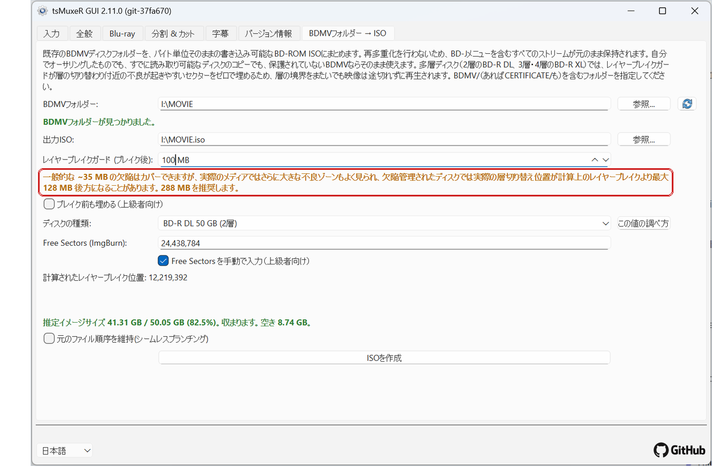

約35 MBを下回ると赤色になります。映像が、実機で不良と分かっているセクターに当たる可能性があります。

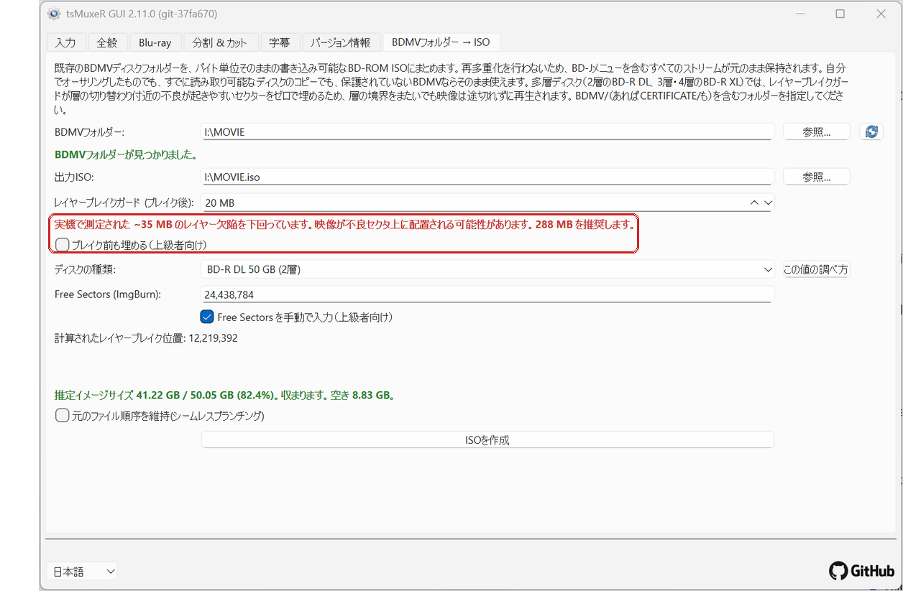

迷ったら288 MBのままにしてください。1 GBを超えるまれな欠陥のために、この欄は9999まで設定できます。

## 上級者向けの設定

`ブレイク前も埋める` は、ブレイクの前にも2つ目の小さなガードゾーンを置きます（既定4 MB）。通常のガードは意図的に非対称です。ほとんどの欠陥は次の層の先頭に生じるためです。ブレイクの直前でも不良が起きるメディアの場合にのみ、この設定をオンにしてください。

`元のファイル順序を維持（シームレスブランチング）` は、ファイルの並べ替えを防ぎます。通常は最大のファイルが先頭に置かれ、ガードに最適な位置が与えられます。ディスクがシームレスブランチング（ストリームファイルが元の順序のままでなければならない方式）に依存している場合は、代わりにここにチェックを入れます。

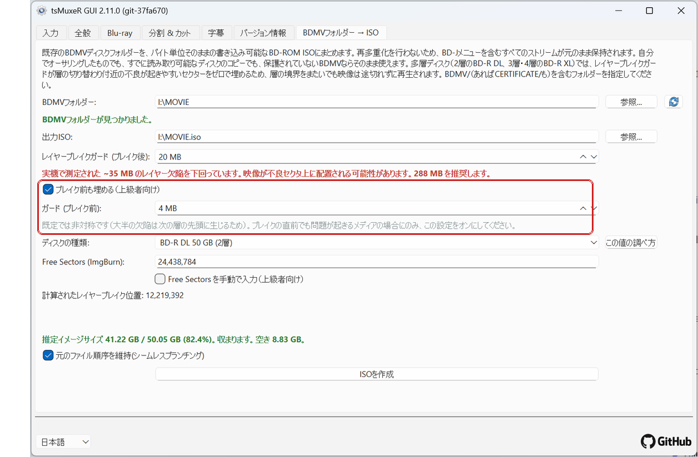

## ソースとしてのディスクまたはマウント済みISO

このタブは、ドライブやマウント済みISO（ここでは `J:`）を直接指定することもできます。青いメッセージは、ソースが読み取り専用であることを知らせています。そのため出力ISOは書き込み可能なドライブに保存されます。

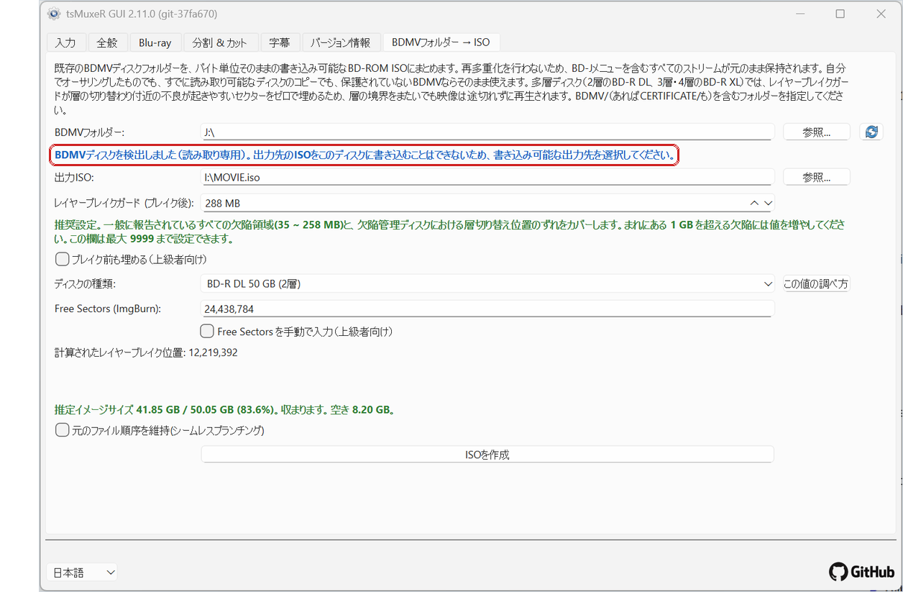

## 作成する

`ISOを作成` をクリックします。進行状況ウィンドウにパーセント値とtsMuxeRのログが表示され、適用されているガード設定も確認できます。

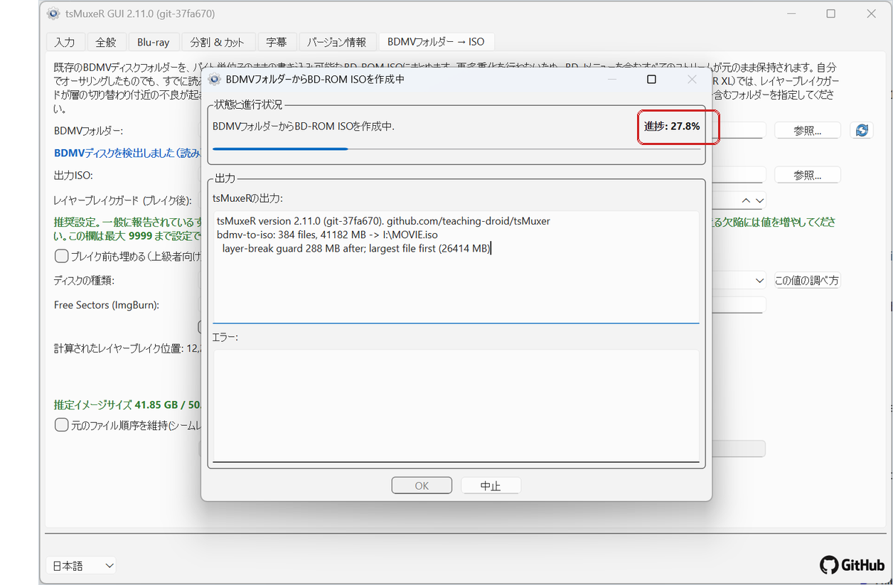

## 完了レポートの読み方

処理が終わると、ログの最後にレイヤーブレイクレポートが表示されます:

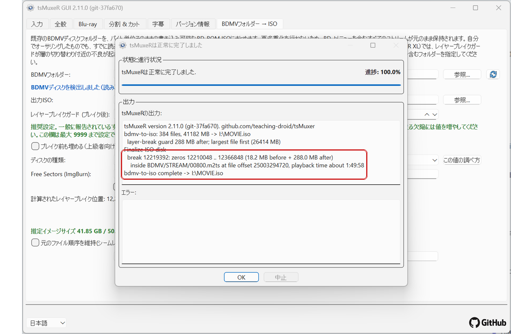

各ブレイクについて、次のことが記されています:

* ブレイクのセクターと、その周囲のゼロ埋めの正確な範囲、
* ブレイクが入るストリームファイル、
* そしてその位置の**再生時間**（ここでは約1:49:58）。

再生時間は役に立つ部分です。まさにその瞬間にプレーヤーが次の層へ移ります。書き込んだディスクを確認したい場合は、この時間に飛んで切り替わりを見てください。目に見える一時停止なく再生されるはずです。

## layerbreakテキストファイル

ISOの隣に、ISOにちなんだ名前の小さなテキストファイルが作られます（例: `MOVIE.iso.layerbreak.txt`）。同じレイヤーブレイクレポートが入っているので、あとから何も作り直さずにブレイク位置と再生時間を確認できます。ISOを今後の書き込みのために保管する場合は、このテキストファイルも一緒に保管してください。

## 書き込み

いつもの書き込みソフト（例: ImgBurn）でISOを書き込みます。特別な設定は不要です。レイヤーブレイクはすでにイメージ内に設定・保護されています。書き込み後は、レポートの再生時間を使って、できあがったディスクで層の切り替わりを確認できます。
