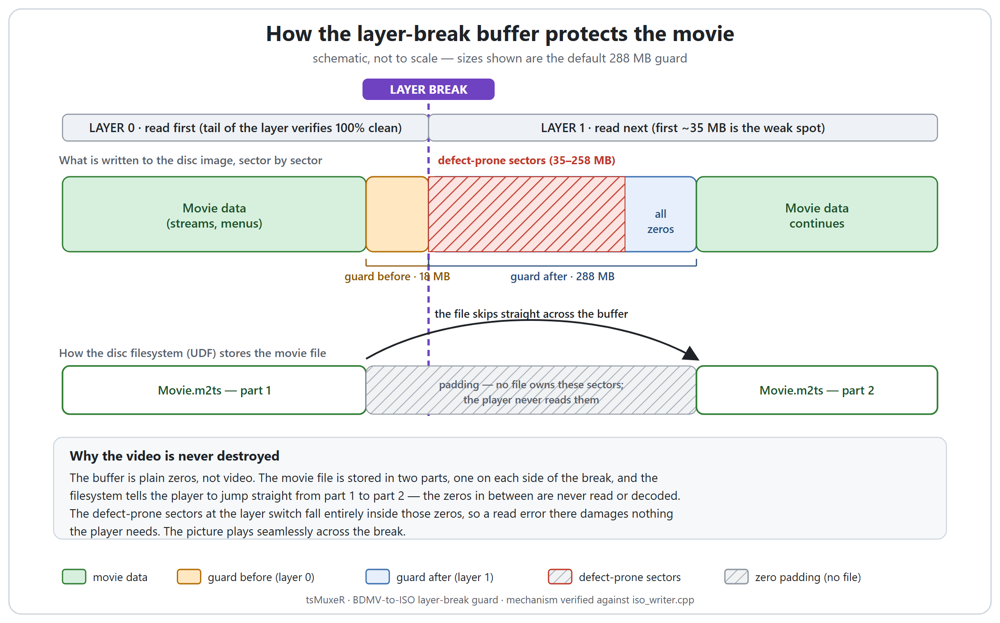
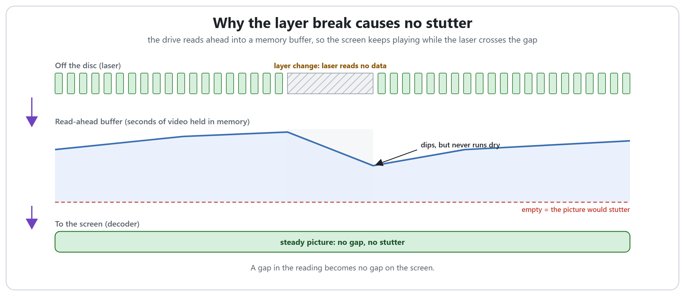
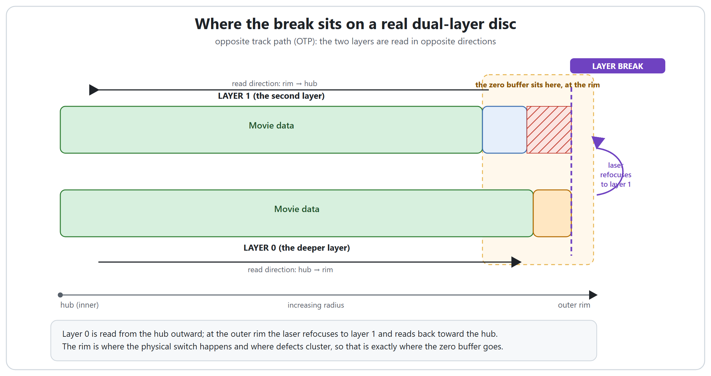

# The layer-break buffer, and why it never damages the movie

On a dual-layer disc the player has to jump from one recorded layer to the next in the
middle of the film. The sectors right at that jump are the most defect-prone on the whole
disc. tsMuxeR protects the movie by filling that danger zone with a **buffer of zero
sectors** (the "layer-break guard"). This page shows exactly what that buffer looks like on
the disc and explains, step by step, why putting a block of zeros in the middle of the image
never destroys the video.

If you just want to author a disc, the [BDMV folder to ISO guide](BDMV_TO_ISO.md) is all you
need; the guard is on by default. This page is for anyone who wants to understand what is
happening underneath.

## What the buffer is

The buffer is a run of **zero-filled sectors** written into the disc image at the layer
break. It is not video, not audio, not a menu, just zeros. By default it is **288 MB** on
the second layer plus a smaller **18 MB** on the first layer, one buffer per layer break (a
dual-layer disc has one; a triple-layer BD-R XL has two; a quad-layer has three).

## Why the video is never destroyed

Dropping a big block of zeros into the middle of the image sounds like it should corrupt the
film. It does not, and the reason is worth understanding:

1. **The buffer is plain zeros, not video.** The movie's streams, menus and playlists are
   never written into the buffer, so there is nothing there to damage in the first place.

2. **The movie file is stored in two parts, one on each side of the break.** When the writer
   reaches the buffer in the middle of a file, it ends that file's current fragment, writes
   the zeros, then continues the same file in a fresh fragment just past the danger zone. The
   disc filesystem (UDF) is built for exactly this: one file can be split across many
   fragments and still be a single, valid file.

3. **The player follows the file's map, not the raw order of sectors on the disc.** It reads
   part 1, and the filesystem tells it that part 2 lives a little further along, so it jumps
   straight there. **It never reads the zeros in between**; they belong to no file. The
   decoder receives one continuous, gap-free stream, exactly as if the buffer were not there.

4. **The defect-prone sectors fall entirely inside the zeros.** The physical layer switch,
   and the weak sectors that cluster right after it, sit wholly within the buffer. If a
   burned disc has unreadable sectors there, it changes nothing: no part of the movie was
   ever stored on them.

5. **So playback stays seamless.** The drive performs the physical layer change while the
   player is skipping over padding it would ignore anyway. By the time the player needs
   part 2, the laser is already reading the good sectors of the next layer.

In short: **the buffer is a moat of zeros around the disc's worst sectors, and the movie file
steps over the moat instead of through it.**

## But doesn't the drive stall while it crosses the gap?

A fair question: at the layer break the laser still has to refocus onto the other layer and
travel across the whole block of zeros, which is a long way physically. Why is there no pause
or dropout in the picture while it does that?

Because the drive never feeds the decoder straight from the laser. Everything the laser reads
first lands in a **read-ahead buffer** (a memory cache inside the drive and the player), and
the picture you watch is played *out of that buffer*, not directly off the disc. So while the
decoder calmly drains the few seconds of video already sitting in the buffer, the drive
performs the physical layer change and steps over the zeros in the background. The jump takes
a fraction of a second; the buffer holds far more play time than that, so the decoder never
runs dry and the picture never so much as flickers. It is the same trick that lets a portable
CD player survive a knock without the music skipping.

## Where the break sits on the disc

A dual-layer disc uses an *opposite track path*: layer 0 is recorded from the hub outward,
and at the outer rim the laser refocuses onto layer 1 and reads back toward the hub. The
outer rim is therefore where the physical switch happens, and, on real media, where defects
cluster. That is precisely where the buffer goes.

## Why the buffer is bigger on one side

The guard is deliberately **asymmetric**: 288 MB after the break, only 18 MB before it. This
is not arbitrary. Measurements on real Verbatim BD-R DL media showed the first ~35 MB of the
second layer uncorrectable, while the tail of the first layer verified 100% clean. The defect
lives at the *start of the next layer*, so that is where the protection is concentrated. The
smaller side is one sixteenth of the larger one (with a 4 MB floor), enough to cover the rare
media that are weak on both sides of the transition.

## The colour hint in the GUI

When you change the guard value, the hint under the field changes colour to tell you what
that value protects against:

| Guard value    | Hint  | What it means                                                                                                  |
|----------------|-------|----------------------------------------------------------------------------------------------------------------|
| 0 MB           | grey  | Alignment only, no defect protection.                                                                         |
| under 35 MB    | red   | Below the ~35 MB defect measured on real hardware. Video may land on bad sectors.                              |
| 35 to 287 MB   | amber | Covers the typical ~35 MB defect, but larger zones are common, and a defect-managed disc can shift the true switch up to 128 MB past the calculated break. |
| 288 MB and up  | green | Recommended. Covers all commonly reported defect zones (35 to 258 MB) and the shifted switch. Goes up to 9999 for the rare defect over 1 GB. |

The default of 288 MB is the green, recommended value. Leave it there unless you have a
specific reason not to.

## What if the movie is bigger than one layer

Usually tsMuxeR can arrange the disc so the break falls cleanly *between* two whole files, and
then no file is split at all. But a single movie can be larger than one layer, in which case
one file genuinely has to cross the break. The protection is the same: the buffer still
brackets the danger zone with zeros, the file is stored as two fragments, and the player steps
across exactly as described above. The only difference is that the join is inside one file
rather than between two.

## In one sentence

The layer-break buffer is a block of zeros placed over the disc's most defect-prone sectors;
the movie is stored as two fragments on either side of it, the player jumps straight from one
to the other without ever reading the zeros, and so the picture plays seamlessly across the
break no matter what happens to those sectors on a burned disc.

---

See also the [BDMV folder to ISO guide](BDMV_TO_ISO.md) for step-by-step authoring and
[DISC_AUTHORING.md](DISC_AUTHORING.md) for the layer-break calculator and the command-line
options.
