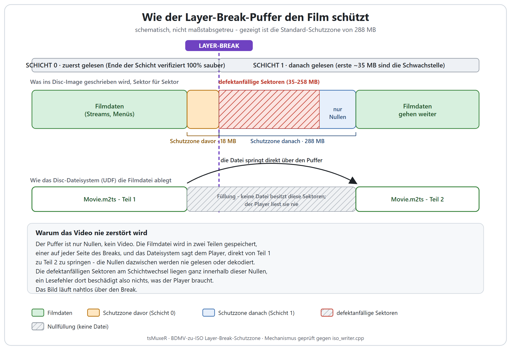
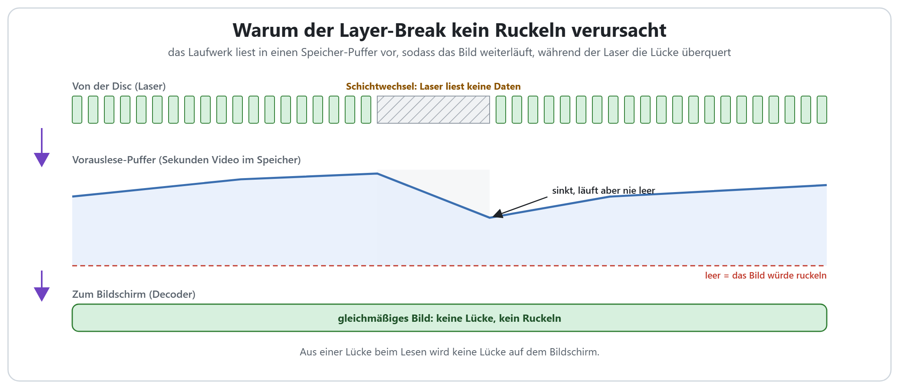
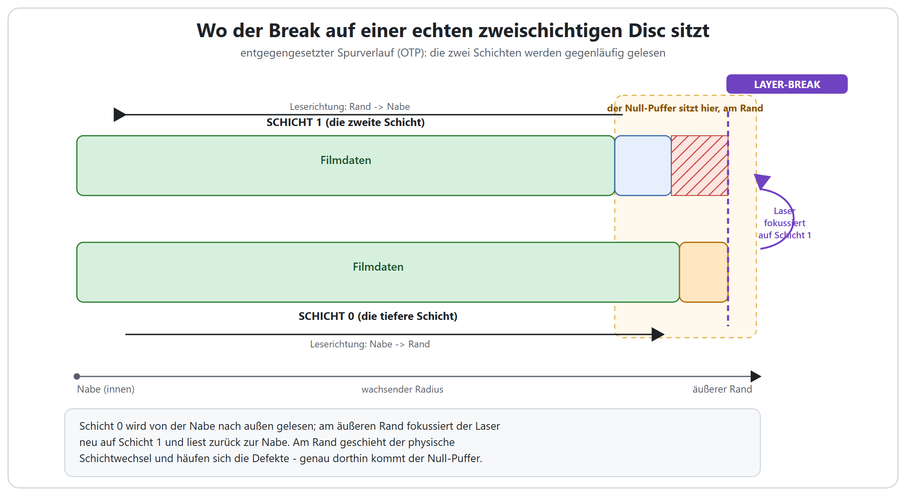

# Der Layer-Break-Puffer, und warum er den Film nie beschädigt

Bei einer zweischichtigen Disc muss der Player mitten im Film von einer beschriebenen Schicht
auf die nächste springen. Die Sektoren genau an diesem Sprung sind die defektanfälligsten der
ganzen Disc. tsMuxeR schützt den Film, indem es diese Gefahrenzone mit einem **Puffer aus
Null-Sektoren** füllt (der "Layer-Break-Schutzzone"). Diese Seite zeigt genau, wie dieser
Puffer auf der Disc aussieht, und erklärt Schritt für Schritt, warum ein Block Nullen mitten
im Image das Video nie zerstört.

Wenn Sie einfach nur eine Disc erstellen wollen, genügt die [Anleitung BDMV-Ordner in
ISO](BDMV_TO_ISO_DE.md); die Schutzzone ist voreingestellt aktiv. Diese Seite ist für alle,
die verstehen wollen, was darunter passiert.

## Was der Puffer ist

Der Puffer ist eine Folge **mit Nullen gefüllter Sektoren**, die am Layer-Break in das
Disc-Image geschrieben wird. Es ist kein Video, kein Audio, kein Menü, nur Nullen.
Voreingestellt sind es **288 MB** auf der zweiten Schicht plus kleinere **18 MB** auf der
ersten Schicht, ein Puffer pro Layer-Break (eine zweischichtige Disc hat einen; eine
dreischichtige BD-R XL hat zwei; eine vierschichtige hat drei).

## Warum das Video nie zerstört wird

Einen großen Block Nullen mitten ins Image zu setzen klingt, als müsste es den Film
beschädigen. Das tut es nicht, und der Grund ist es wert, verstanden zu werden:

1. **Der Puffer ist nur Nullen, kein Video.** Die Streams, Menüs und Playlists des Films
   werden nie in den Puffer geschrieben, es gibt dort also von vornherein nichts zu
   beschädigen.

2. **Die Filmdatei wird in zwei Teilen gespeichert, einer auf jeder Seite des Breaks.** Wenn
   der Schreibvorgang mitten in einer Datei den Puffer erreicht, beendet er das aktuelle
   Fragment dieser Datei, schreibt die Nullen und setzt dieselbe Datei dann in einem neuen
   Fragment direkt hinter der Gefahrenzone fort. Das Disc-Dateisystem (UDF) ist genau dafür
   gebaut: Eine Datei kann über viele Fragmente verteilt sein und bleibt trotzdem eine
   einzige, gültige Datei.

3. **Der Player folgt der Datei-Landkarte, nicht der rohen Reihenfolge der Sektoren auf der
   Disc.** Er liest Teil 1, und das Dateisystem sagt ihm, dass Teil 2 ein Stück weiter liegt,
   also springt er direkt dorthin. **Die Nullen dazwischen liest er nie**; sie gehören zu
   keiner Datei. Der Decoder erhält einen durchgehenden, lückenlosen Stream, genau als wäre
   der Puffer nicht da.

4. **Die defektanfälligen Sektoren liegen vollständig innerhalb der Nullen.** Der physische
   Schichtwechsel und die schwachen Sektoren, die sich direkt danach häufen, sitzen ganz
   innerhalb des Puffers. Hat eine gebrannte Disc dort unlesbare Sektoren, ändert das nichts:
   Kein Teil des Films wurde je auf ihnen gespeichert.

5. **Die Wiedergabe bleibt also nahtlos.** Das Laufwerk führt den physischen Schichtwechsel
   aus, während der Player über Füllmaterial hinwegspringt, das er ohnehin ignorieren würde.
   Wenn der Player Teil 2 braucht, liest der Laser bereits die guten Sektoren der nächsten
   Schicht.

Kurz gesagt: **Der Puffer ist ein Graben aus Nullen um die schlechtesten Sektoren der Disc,
und die Filmdatei tritt über den Graben hinweg, statt durch ihn hindurch.**

## Aber bleibt das Laufwerk nicht hängen, wenn es die Lücke überquert?

Eine berechtigte Frage: Am Layer-Break muss der Laser trotzdem neu auf die andere Schicht
fokussieren und den ganzen Block Nullen überqueren, physisch also eine gute Strecke. Warum
gibt es dabei keine Verzögerung und keinen Aussetzer im Bild?

Weil das Laufwerk den Decoder nie direkt vom Laser versorgt. Alles, was der Laser liest,
landet zuerst in einem **Vorauslese-Puffer** (einem Speicher-Cache im Laufwerk und im Player),
und das Bild, das Sie sehen, wird *aus diesem Puffer* wiedergegeben, nicht direkt von der Disc.
Während der Decoder also in aller Ruhe die paar Sekunden Video abarbeitet, die schon im Puffer
liegen, führt das Laufwerk im Hintergrund den physischen Schichtwechsel aus und tritt über die
Nullen hinweg. Der Sprung dauert den Bruchteil einer Sekunde; der Puffer fasst weit mehr
Spielzeit als das, sodass dem Decoder nie der Nachschub ausgeht und das Bild nicht einmal
zuckt. Es ist derselbe Trick, mit dem ein tragbarer CD-Player einen Stoß übersteht, ohne dass
die Musik springt.

## Wo der Break auf der Disc sitzt

Eine zweischichtige Disc nutzt einen *entgegengesetzten Spurverlauf*: Schicht 0 wird von der
Nabe nach außen beschrieben, und am äußeren Rand fokussiert der Laser neu auf Schicht 1 und
liest zurück zur Nabe. Am äußeren Rand geschieht daher der physische Schichtwechsel, und auf
echten Medien häufen sich dort die Defekte. Genau dorthin kommt der Puffer.

## Warum der Puffer auf einer Seite größer ist

Die Schutzzone ist bewusst **asymmetrisch**: 288 MB nach dem Break, nur 18 MB davor. Das ist
nicht willkürlich. Messungen an echten Verbatim BD-R DL Medien zeigten die ersten ~35 MB der
zweiten Schicht als unkorrigierbar, während das Ende der ersten Schicht zu 100% sauber
verifizierte. Der Defekt sitzt am *Anfang der nächsten Schicht*, dort wird also der Schutz
konzentriert. Die kleinere Seite ist ein Sechzehntel der größeren (mit einem Minimum von 4 MB),
genug für die seltenen Medien, die auf beiden Seiten des Übergangs schwach sind.

## Der farbige Hinweis in der GUI

Wenn Sie den Wert der Schutzzone ändern, wechselt der Hinweis unter dem Feld die Farbe und
sagt Ihnen, wovor dieser Wert schützt:

| Wert der Schutzzone | Hinweis | Was er bedeutet |
|---------------------|---------|-----------------|
| 0 MB                | grau    | Nur Ausrichtung, kein Defektschutz. |
| unter 35 MB         | rot     | Unter dem ~35 MB Defekt, der auf echter Hardware gemessen wurde. Video kann auf schlechten Sektoren landen. |
| 35 bis 287 MB       | orange  | Deckt den typischen ~35 MB Defekt ab, aber größere Zonen sind häufig, und eine Disc mit Fehlerverwaltung kann den wahren Schichtwechsel bis zu 128 MB hinter den berechneten Break verschieben. |
| 288 MB und mehr     | grün    | Empfohlen. Deckt alle häufig gemeldeten Defektzonen (35 bis 258 MB) und den verschobenen Schichtwechsel ab. Reicht bis 9999 für den seltenen Defekt über 1 GB. |

Die Voreinstellung von 288 MB ist der grüne, empfohlene Wert. Lassen Sie ihn stehen, sofern
Sie keinen bestimmten Grund dagegen haben.

## Was, wenn der Film größer als eine Schicht ist

Meist kann tsMuxeR die Disc so anordnen, dass der Break sauber *zwischen* zwei ganze Dateien
fällt, und dann wird gar keine Datei geteilt. Ein einzelner Film kann aber größer als eine
Schicht sein, und dann muss eine Datei den Break tatsächlich überqueren. Der Schutz ist
derselbe: Der Puffer umschließt die Gefahrenzone weiterhin mit Nullen, die Datei wird als
zwei Fragmente gespeichert, und der Player tritt genau wie oben beschrieben darüber hinweg.
Der einzige Unterschied ist, dass die Naht innerhalb einer Datei liegt statt zwischen zweien.

## In einem Satz

Der Layer-Break-Puffer ist ein Block Nullen über den defektanfälligsten Sektoren der Disc;
der Film wird als zwei Fragmente auf beiden Seiten davon gespeichert, der Player springt
direkt vom einen zum anderen, ohne je die Nullen zu lesen, und so läuft das Bild nahtlos über
den Break, egal was mit diesen Sektoren auf einer gebrannten Disc geschieht.

---

Siehe auch die [Anleitung BDMV-Ordner in ISO](BDMV_TO_ISO_DE.md) für das schrittweise
Authoring und [DISC_AUTHORING_DE.md](DISC_AUTHORING_DE.md) für den Layer-Break-Rechner und die
Kommandozeilenoptionen.
