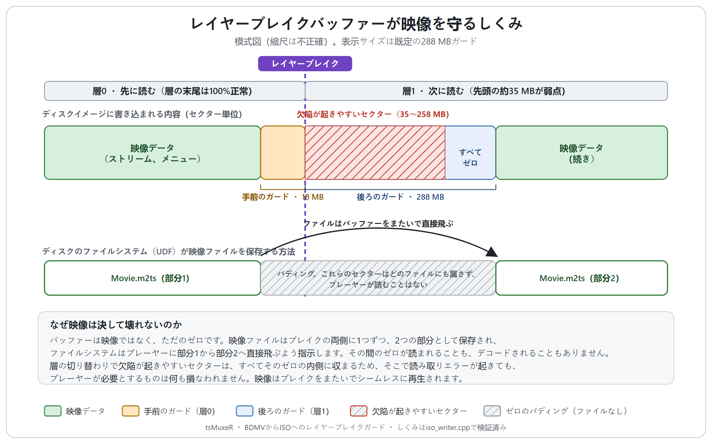
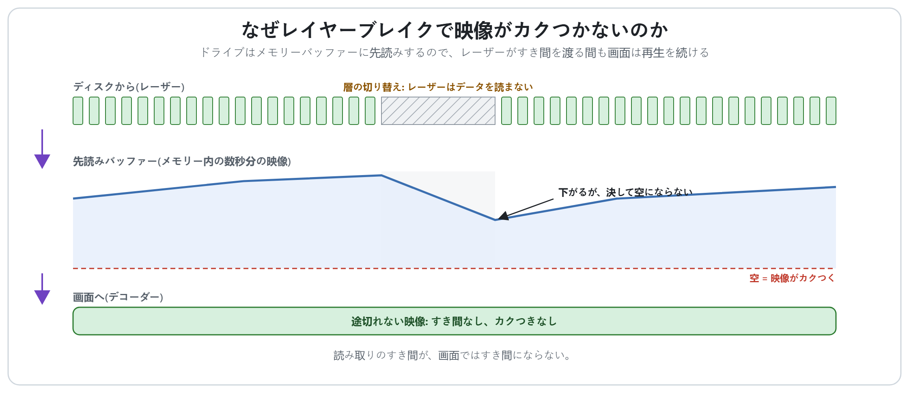
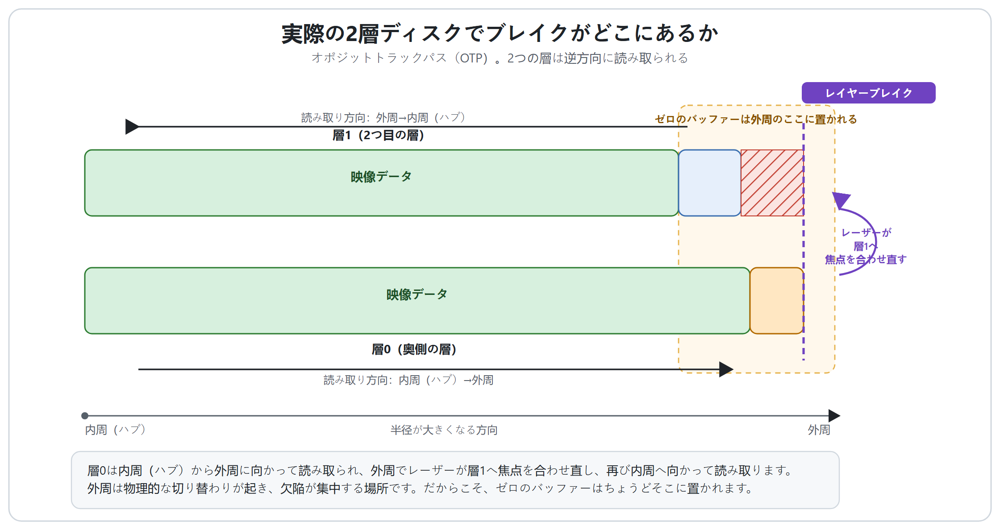

# レイヤーブレイクバッファーと、それが映像を決して壊さない理由

2層ディスクでは、プレーヤーは映画の途中で、記録された一方の層からもう一方の層へと飛び移らなければなりません。その切り替わりのすぐそばにあるセクターは、ディスク全体の中で最も欠陥が起きやすい部分です。tsMuxeRは、その危険な領域を**ゼロセクターのバッファー**（「レイヤーブレイクガード」）で埋めることで映像を保護します。このページでは、そのバッファーがディスク上で実際にどのような姿になるのかを示し、イメージの途中にゼロの塊を置いても映像が決して壊れない理由を、順を追って説明します。

ディスクをオーサリングしたいだけであれば、[BDMVフォルダーをISOに変換するガイド](BDMV_TO_ISO_JA.md)だけで十分です。ガードは既定で有効になっています。このページは、その裏側で何が起きているのかを理解したい方のためのものです。

## バッファーとは何か

バッファーとは、レイヤーブレイクの位置でディスクイメージに書き込まれる**ゼロ埋めのセクター**の連なりです。映像でも音声でもメニューでもなく、ただのゼロです。既定では、2つ目の層に**288 MB**、そして1つ目の層にそれより小さい**18 MB**が置かれ、レイヤーブレイク1か所につき1つのバッファーが対応します（2層ディスクは1つ、3層のBD-R XLは2つ、4層は3つ）。

## なぜ映像は決して壊れないのか

イメージの途中に大きなゼロの塊を落とし込むと、いかにも映像が壊れそうに聞こえます。しかし実際には壊れません。その理由は理解しておく価値があります。

1. **バッファーは映像ではなく、ただのゼロです。** 映像のストリーム、メニュー、プレイリストがバッファーに書き込まれることは一切ないので、そもそもそこには壊れるものが何もありません。

2. **映像ファイルは、ブレイクの両側に1つずつ、2つの部分に分けて保存されます。** ファイルの途中でライターがバッファーに達すると、そのファイルの現在のエクステント（断片）をいったん終え、ゼロを書き込み、危険領域を過ぎたところで新しいエクステントとして同じファイルを続けます。ディスクのファイルシステム（UDF）は、まさにこのために作られています。1つのファイルを複数のエクステントに分割しても、依然として1つの有効なファイルであり続けられます。

3. **プレーヤーは、ディスク上のセクターの生の並び順ではなく、ファイルのマップに従います。** プレーヤーはまず部分1を読み、ファイルシステムが「部分2はもう少し先にある」と教えるので、そこへ直接飛びます。**その間にあるゼロを読むことは決してありません**。ゼロはどのファイルにも属していないからです。デコーダーは、バッファーがまるで存在しないかのように、1本の途切れのない連続したストリームを受け取ります。

4. **欠陥が起きやすいセクターは、すべてゼロの内側に収まります。** 物理的な層の切り替わりと、その直後に集中する弱いセクターは、まるごとバッファーの中に位置します。焼いたディスクにそこで読み取れないセクターがあっても、何も変わりません。映像のどの部分もそこには保存されていないからです。

5. **だから再生はシームレスに保たれます。** ドライブが物理的な層の切り替えを行うのは、プレーヤーがどのみち無視するパディングを読み飛ばしている間です。プレーヤーが部分2を必要とするころには、レーザーはすでに次の層の良好なセクターを読み取っています。

つまり、**バッファーはディスク最悪のセクターを取り囲むゼロの堀であり、映像ファイルはその堀の中を通るのではなく、堀を飛び越えていくのです。**

## ドライブはすき間を渡る間、止まってしまわないのか？

もっともな疑問です。レイヤーブレイクでは、レーザーはやはりもう一方の層へ焦点を合わせ直し、ゼロの塊まるごとを渡らなければならず、物理的にはかなりの距離になります。その間、なぜ映像に遅延や途切れが起きないのでしょうか。

それは、ドライブがデコーダーにレーザーから直接データを送ることは決してないからです。レーザーが読み取ったものはすべて、まず**先読みバッファー**（ドライブとプレーヤーの中にあるメモリーキャッシュ）に入り、あなたが見ている映像は、ディスクから直接ではなく*そのバッファーから*再生されています。つまりデコーダーが、すでにバッファーにある数秒分の映像を落ち着いて消費している間に、ドライブは裏側で物理的な層の切り替えを行い、ゼロを飛び越えるのです。切り替えにかかるのはほんの一瞬で、バッファーはそれよりはるかに長い再生時間分を蓄えているため、デコーダーのデータが尽きることはなく、映像はちらつくことすらありません。これは、携帯型CDプレーヤーが衝撃を受けても音楽が飛ばないのと同じしくみです。

## ブレイクがディスク上のどこにあるのか

2層ディスクは*オポジットトラックパス（逆方向トラック）*を採用しています。層0は内周（ハブ）から外周に向かって記録され、外周でレーザーが層1へと焦点を合わせ直し、今度は内周（ハブ）に向かって読み取っていきます。したがって外周こそが物理的な切り替わりが起きる場所であり、実際のメディアでは欠陥が集中する場所です。バッファーが置かれるのは、まさにそこです。

## なぜバッファーは片側だけ大きいのか

ガードは意図的に**非対称**になっています。ブレイクの後ろには288 MB、手前にはわずか18 MBです。これは行き当たりばったりではありません。実際のVerbatim製BD-R DLメディアでの計測では、2つ目の層の先頭の約35 MBが訂正不能である一方、1つ目の層の末尾は100%正常であることが確認されました。欠陥は*次の層の先頭*に存在するため、保護はそこに集中させています。小さい側は大きい側の16分の1（最低4 MB）で、切り替わりの両側が弱いまれなメディアをカバーするのに十分な量です。

## GUIの色によるヒント

ガードの値を変更すると、欄の下のヒントの色が変わり、その値が何に対して保護になるのかを教えてくれます。

| ガードの値 | ヒント | 意味 |
|----------------|-------|----------------------------------------------------------------------------------------------------------------|
| 0 MB | 灰色 | 整列のみ。欠陥に対する保護はありません。 |
| 35 MB未満 | 赤色 | 実機で計測された約35 MBの欠陥を下回っています。映像が不良セクターに乗る可能性があります。 |
| 35～287 MB | 黄色（オレンジ色） | 典型的な約35 MBの欠陥はカバーしますが、より大きな領域もよくあり、欠陥管理ディスクでは実際の切り替わりが計算上のブレイクより最大128 MB後ろにずれることがあります。 |
| 288 MB以上 | 緑色 | 推奨値。一般に報告されているすべての欠陥領域（35～258 MB）と、ずれた切り替わりをカバーします。1 GBを超えるまれな欠陥のために9999まで設定できます。 |

既定値の288 MBが、緑色の推奨値です。特に変える理由がない限り、そのままにしておいてください。

## 映像が1つの層より大きい場合

通常tsMuxeRは、ブレイクが2つのファイルまるごとの*間*にきれいに落ちるようにディスクを配置でき、その場合はどのファイルも分割されません。しかし1本の映像が1つの層より大きくなることもあり、そのときは1つのファイルが本当にブレイクをまたがなければなりません。保護のしくみは同じです。バッファーは相変わらず危険領域をゼロで挟み込み、ファイルは2つのエクステント（断片）として保存され、プレーヤーは上で説明したとおりにまたいで進みます。唯一の違いは、つなぎ目が2つのファイルの間ではなく、1つのファイルの内部にあるという点だけです。

## ひとことで言えば

レイヤーブレイクバッファーとは、ディスクの最も欠陥が起きやすいセクターの上に置かれたゼロの塊です。映像はその両側に2つのエクステント（断片）として保存され、プレーヤーはゼロを一切読むことなく一方からもう一方へ直接飛び移ります。そのため、焼いたディスク上でそれらのセクターに何が起きようとも、映像はブレイクをまたいでシームレスに再生されます。

---

順を追ったオーサリング手順については[BDMVフォルダーをISOに変換するガイド](BDMV_TO_ISO_JA.md)を、レイヤーブレイク計算機とコマンドラインオプションについては[DISC_AUTHORING_JA.md](DISC_AUTHORING_JA.md)も参照してください。
